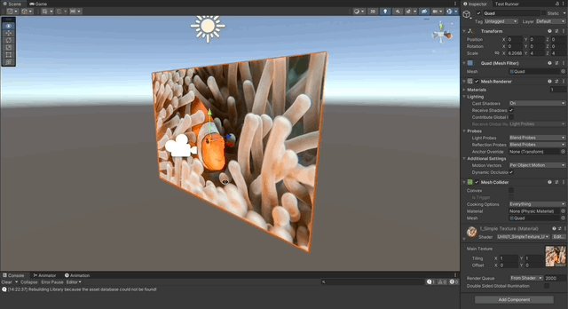

# Cg Shaders in Unity

A collection of Shaders written in **Cg** for the **Built-in RP** in Unity, from basic to advanced.

## Features

- [Simple 2D Texture](#simple-2d-texture)

---

## Simple 2D Texture

1. Expose a ShaderLab property to take in a `2D` texture.
1. Connect the property to the Cg program, using a `sampler2D` variable.
1. Use the [tex2D](https://developer.download.nvidia.com/cg/tex2D.html) function from cg to map a pixel from the texture, to a pixel of the fragment, using the uv coordinates.

---

## References

- [Learn Unity Shaders from Scratch by Nik Lever](https://www.udemy.com/course/learn-unity-shaders-from-scratch)
