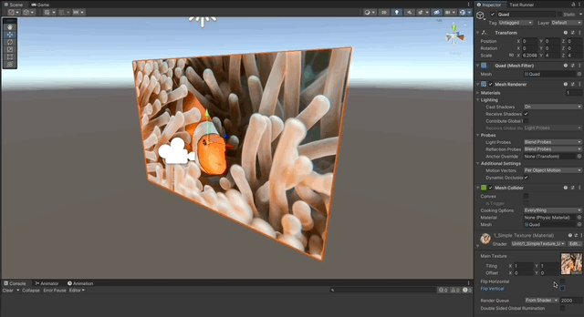
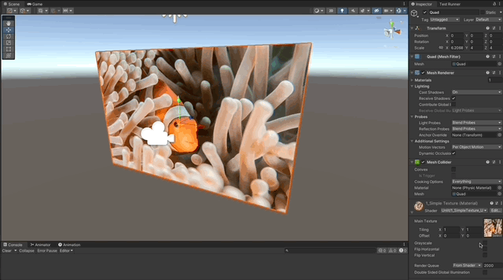
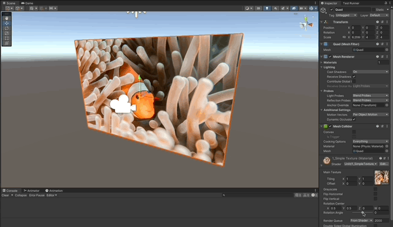

# Cg Shaders in Unity

A collection of Shaders written in **Cg** for the **Built-in RP** in Unity, from basic to advanced.

### References

- [Learn Unity Shaders from Scratch by Nik Lever](https://www.udemy.com/course/learn-unity-shaders-from-scratch)

## Features

- [Simple 2D Texture](#simple-2d-texture)
  - [Flip Texture](#flip-texture)
  - [Grayscale](#grayscale)
  - [Rotate Texture](#rotate-texture)
- [Ripple Effect](#ripple-effect)

---

## Simple 2D Texture

1. Expose a ShaderLab property to take in a `2D` texture.
1. Connect the property to the Cg program, using a `sampler2D` variable.
1. Use the [tex2D()](https://developer.download.nvidia.com/cg/tex2D.html) function from cg to map a pixel from the texture, to a pixel of the fragment, using the uv coordinates.

```c
_MainTexture("Main Texture", 2D) = "white" {}
```

```c
fixed3 color = tex2D(_MainTexture, uv).rgb;
```


### Flip Texture

1. Subtract the uvs to make them flip along x or y.

```c
float2 uv = float2(
    _FlipHorizontal ? 1 - i.uv.x : i.uv.x,
    _FlipVertical ? 1 - i.uv.y : i.uv.y
);
```



### Grayscale

1. Use just a channel for all colors (not ideal).

```c
fixed3 color = _Grayscale ? texColor.rrr : texColor.rgb;
```



### Rotate Texture

1. Use a rotation matrix to rotate the uvs along a specified center.

```c
float2x2 rotation = getRotationMatrix2D(UNITY_PI * _RotationAngle);
uv = mul(uv - _RotationCenter.xy, rotation) + _RotationCenter.xy;
```



### Ripple Effect

1. Get the current pixel position, this will define the axis along which we will get a displaced uv.
1. Calculate the distance of the current uv to the center, by using [length()](https://developer.download.nvidia.com/cg/length.html).
1. Displace the uv by multiplying by the `distance` and then also mixing in the `_Time` to make it oscillate.

```c
fixed4 frag (v2f i) : COLOR
{
    // use the coordinate system that is centered in (0.5, 0.5)
    float2 pixelPos = i.position.xy * 2.0;

    // get a displacement in the direction of the ray from the center to the pixel
    float distanceToCenter = length(pixelPos);
    float2 displacement = pixelPos / distanceToCenter * 0.03 * cos(
        distanceToCenter * (1 / _RippleSize) - _Time.y * _RippleVelocity
    );

    // find the texel we want to show
    float2 ripple = i.uv + displacement;

    float4 texColor = tex2D(_MainTexture, ripple);
    fixed3 color = texColor.rgb;

    return fixed4(color, 1.0);
}
```


